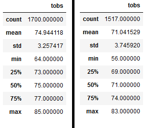

# Surf'n'Shake

## Purpose of Surf'n'Shake:
#### W. Avy, an avid surfer, wants to help us open up our first surf shop. However, his major concern is the weather. He wants us to gather more information about weather trends and temperatures before he commits to funding our project. In this case, he specifically asked us to analyze the temperature data for the months of June and December in Oahu.

## Results:

The picture above represents the temperature data for June, on the left, and December, on the right.
  <u>As can be seen:</u> 
- Average temperatures are slightly higher in June than in December, 74.94°F vs 71.04°F respectively.
- The range in temperature is 21°F with a max of 85°F and low of 64°F in June. As for December, the range being 27°F was slightly higher, with temperatures varying between 83°F and 56°F.
- The standard deviation for June is around 3.26°F and December is 3.75°F. Meaning that our data is overall less spread out.

## Summary:
The above shows that the temperatures do not vary much between the two month, June and December. This is great news for a surf shop that wants to be open all year around. In order to make sure that this is a good investment however, I would perform two more additional queries:
1. Find out the precipitation data for the month of June and December. 
2. Filter temperature data results by specific weather stations on Oahu. See if one station has more measurement data, increasing the likelihood of more accurate data.

